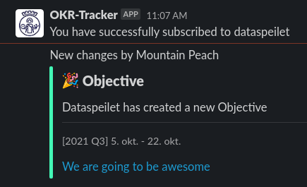
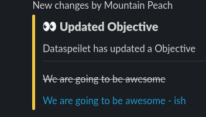
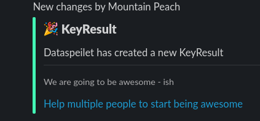
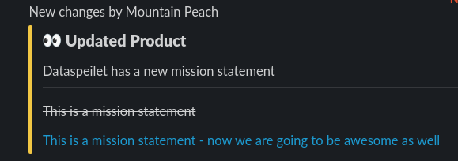

# Changelog

All notable changes to this project will be documented in this file. The format is based on [Keep a Changelog](https://keepachangelog.com/en/1.0.0/), and this project adheres to [Semantic Versioning](https://semver.org/spec/v2.0.0.html).

## [UNRELEASED]

### Changes

- Showing loading spinner when fetching KPI/KeyResult progress
- Moved widgets around for a better UX experience for mobile users
- Updated dependencies

### Fixed

- When updating Org/Dep/Prod, the state store would get corrupt and only refresh fixed it. Double documents would show because vuexfire does not handle hundreds of documents that well.
- functions: config to active slackbot or not actually works

## [2.5.3] 2021-10-27

### Fixed

- KPI graph did not show if one progress object had a value equal to 0

## [2.5.2] 2021-10-19

### Fixed

- Actually fixed the bug showing `Update value`-button even if you did not have access

### Changes

- Small style changes for a better UX experience - in a series of different changes coming

## [2.5.1] 2021-10-19

### Fixed

- `Update value`-button in KeyResultHome was shown even though you did not have access to update

### Changes

- Removed sass-variables for colors, using CSS Variables instead
- Updated README with more information when deploying to prod for the first time
- Updated dependencies

## [2.5.0] 2021-10-14

We have added another slackbot integration. The new slackbot integration pushes changes to organizations/departments/products.

You can call the slack bot with the command `/okr`. The different commands to the slack bot are:
- `subscribe organization/department/product slug` - subscribe to a specific org/dep/prod
- `unsubscribe organization/department/product slug` - unsubscribe
- `subscribe/all organization/department slug` - subscribe to a specific org/dep/prod and all its children (departments/products)
- `unsubscribe/all organization/department slug` - unsubscribe to everything

What types of updates does the bot push?
Changes to the:
- name
- mission statement

Creation of:
- Objectives
- Key Results

Caveats:
- If you run subscribe/all once on an organization/department and create a new product after that
  - run subscribe/all again, because we don't add new children to the parent subscription

## Added

- Slack bot integration with channels in your slack organization. Push updates to a slack channel. (Read the readme about the changes and how to implement it)

Example:
`/okr subscribe product dataspeilet`

Now we would get updates to our slack channel with changes to our product, dataspeilet. (Mountain Peach is the name of our test user)

## Changes

- Save-buttons are disabled until changes have been made.
- Updated instructions on how to initialize a new okr-tracker instance
- KeyResultHome: moved widgets around for easier access to the edit button
- Updated dependencies

## [2.4.1] 2021-10-05

### Changes

- Format numbers to norwegian locale - thousands are separated with a space (atm we do not support other formatting locales for numbers)
- Moved some util-functions around
- Updated dependencies

### Fixed

- Team members could not create/update Periods/Objectives/KeyResults because of firestore rules
- Toaster for errors from creating Periods/Objectives/KeyResults did not show correctly

## [2.4.0] 2021-10-04

### Added

- Log in with Microsoft (Thank you, @knowit, for the changes)

### Removed

- Removed keycloak integration

## [2.3.1] 2021-09-28

### Fixed

- Normal team members were not actually allowed to update their own organization/department/product

## [2.3.0] 2021-09-28

We have added another lever of admin, called super admin. We are sorry, but you need to update some database documents to make this work.

Super Admin can:
- do the same things as an admin and normal member
- restore backups
- promote or demote admins
- migrate data
- create/restore/change organizations

Admins can:
- do the same things as a member
- add new users to the OKR-tracker
- administrate an organization they are apart of
- administrate multiple products within the same organization
- administrate multiple departments within the same organization

Member of a product or department or organization
- has rights to administrate its own product/org/departments
- ... such as add/remove members from a product/org/department
  - or update/delete/archive

### BREAKING CHANGES

- Added another lever of admin - super admin.
  - Add superAdmin-property to one user, and then that person can give others superAdmin-access
  - Super admin needs to go and update every single product/department/organization to support the new RBAC system (sorry for the inconvenience)

### Fixed

- Users were not allowed to archive its own product or department

## [2.2.1] 2021-09-23

### Added

- Job positions: added Storyteller

### Fixed

- i18n corrections
- Dashboard: PieChart not rendering correctly

## [2.2.0] 2021-09-14

### Added

- Users can choose what type of user they are from a predefined list of job positions. This is done in the `My Profile`-page
- PieChart follows color scheme

### Changes

- Styles
- TeamWidget: Multiple job positions are grouped into a parent position, i.e.: backend-, frontend-, mobile-, hardware-developers are grouped into `Developers`
- Updated dependencies
- Removed redundant firebase config environment keys
- Updated readme for a better understanding of firebase private keys

### Removed

- Removed sass-loader because we don't use webpack anymore

## [2.1.2] 2021-09-02

### Fixed

- Nothing happened when trying to archive Periods/Objectives/Key Results

## [2.1.1] 2021-08-31

### Changes

- Tab title changes together with the navbar title

## [2.1.0] 2021-08-30

We have removed vue-cli and moved to vitejs for better develop experience and faster build and deploy times. This also means that from now on that we won't support IE11 at all. The chance that IE11 shows only a white screen is highly possible. We only support evergreen/modern browsers

### Added

- Use Firebase auth emulator to emulate authentication (only for developers)

### Changes

- Moved from vue-cli to vitejs for our frontend build tool 🎉⚡🔥 Better, faster and leaner developer experience 🎉⚡🔥
- Removed collapse-icon if the item has no children

## [2.0.1] 2021-08-25

### Changes

- Sort KeyResults when in ObjectiveHome-view
- Removed some unnecessary code duplication
- Updated dependencies

## [2.0.0] 2021-08-23

We've decided to release v2 out of RC after almost a year of updates. We feel like the code is stable enough to warrant a v2 release. We haven't managed to develop all the features that we wanted, but we have already been working on a redesign for v2.1 for a couple of months now.

Our next steps are continuing to rewrite the way data is written to the database, move more and more out to a better API and hopefully open up our APIs to our users. And to look at a more robust RBAC with different levels.

See [release notes](./documentation/release-notes_v2.0.0.md).

### Added

- Add team members to Organizations and Departments to offload admin access

## [2.0.0-rc.12] 2021-08-19

### Fixed

- Keycloak: User met with infinite spinner if the user was not whitelisted in the database
- Sort organizations by name
- Small style fixes
- Correct modal size

### Changes

- Updated dependencies

## [2.0.0-rc.11] 2021-04-27

### Fixed

- Removed svg-loader - Icons were not showing correctly for some users
- Fixed SiteHeader not showing correct Prod/Dep/Org-name when doing changes to KPIs/OKRs
- Small fixes to components not using the correct color-styles

## [2.0.0-rc.10] 2021-04-27

We are looking at doing some design changes to the Objective/KeyRes-view, which means that some changes need to be made beforehand. We have therefore implemented a Theme Toggle! You can now toggle between Blue, Yellow and Green color themes.

### Added

- (Beta) Theme Toggle: toggle between Blue, Green or Yellow color themes
  - Switch color theme at the bottom of the sidebar or in the user-menu in the top right corner

### Changes

- Updated dependencies

## [2.0.0-rc.9] 2021-04-19

### Fixed

- ItemAdmin(org/dep/prod): Update failed if API Secret was empty

### Changes

- Updated dependencies

## [2.0.0-rc.8] 2021-03-26

### Added

- Added a security UUID for each team that needs to be sent with the api-call if you want to update KPI/KeyRes for better security.
  - Go to your Org/Dep/Product and add a secret under `API Secret`-input
- KPI: Show curl-example after adding a new KPI and toggled on updated via API
- Key Result: Show curl-example if you toggle the option "update via API"
- CF/API: better logging with express middleware morgan

### Changes

- KeyRes-Graph: if target value is higher than the current value, then expand the y-axis to not go under the x-axis or over the top of the y-axis
- KPIHome: format all values to correct format. Instead of floats -> format to percentage
- Better OpenSpec and API-gateway support.
- Moved API-KEY for Gateway from query-param to header

### Fixed

- CF/API: save progress (KPI/KeyRes) as a number and not a string
- CF/API: Fixed a bug with the KeyRes GET return two responses on the same GET-call which caused the API to crash

## [2.0.0-rc.7] 2021-03-23

### Added

- Cloud Functions: CRUD API for KPI and Key Results. It is now possible to call an end point if you want to update progress through the API and not through the frontend. Locked behind API Gateway with API key, get in contact to get a key.
- API Gateway: added gateway for users to call if they want access to API for KPI and Key Results. Needs API Key from us, contact us to get a key for your own team
- Swagger doc: read more about the new open API end points at https://okr.oslo.systems/api

### Changes

- Disable KPI auto update functionality if you would rather update through the API yourself
- Updated dependencies

### Fixed

- Key result progress "registered by" never showed anything if it was registered automatically by Cloud Functions

## [2.0.0-rc.6] 2021-03-17

OKR-tracker will get out of beta/RC by the end of June 2021. It has been in a beta-state for quite some time now, and we feel it has matured enough for a full release. This does not mean we will stop working on it, since we do have some milestones we would like to hit.

- Remove all client side db-changes. Move everything to a Cloud Function, in that way we can set up a more normal API CRUD backend and not rely on the client db-access.
- Most importantly: refactor RBAC - add different roles with different accesses

### Added

- Cloud Function: CRUD API for requestAccess and creation of user

### Changes

- Drop node-sass support
- Add dart-sass support

## [2.0.0-rc.5] 2021-03-01

### Added

- Dev-environment for users outside of Oslo kommune to test our application before forking/using
- Show User UID in profile
- Custom personalized sign in text for the keycloak sign-in button (default is `Sign in with keycloak`, new environment variable)

# Fixed

- Firestore rules: KeyRes were only allowed for uid-objects and not email-objects

## [2.0.0-rc.4] 2021-02-19

### BREAKING CHANGE

- Service account private key is not optional - it is required to add the private key json-file to firebase functions config (check out the [README](./README.md#supported-providers))
- Changes to environment variables - please read the [README](./README.md#environment-variables)
- Dropped support for Node < 14.x
- Required Node >= 14.x

### Experimental

- Keycloak integration: sign in using keycloak and use the keycloak token to create a custom token for firebase

### Added

- Keycloak integration
- Functions: tokenCreator - create custom tokens for custom auth integration with firebase
- LoadingSmall-component: a loading-animation that is smaller than the normal one
- Logout page: user is redirected here if there is a problem with signing in
- Store new unique id's to user-object for later migration to uid-control
- Alert-components

### Changes

- firestore-rules: Not allowed to read the user-objects without being signed in
- Better support to handling errors or if user does not have access to a resource
- Design of login page

### Removed

- Support for Node < 14.x

## [2.0.0-rc.3] 2021-01-26

### BREAKING CHANGE

- Drop IE 11 support

### Added

- Meta-tags for fb/twitter/open graph
- robots.txt

### Fixed

- Line chart should handle higher values even if it is higher than target value

### Changes

- Cron job changes to scheduled cloud functions
- Set time zone to Europe/Oslo for scheduled cloud functions
- Updated dependencies

## [2.0.0-rc.2] - 2021-01-20

### Added

- Show all comments in progression list for a key result

### Fixed

- Loading loop when trying to access site without credentials
- Automated key results not actually running automatically (cron job set to once a day)
- Line graph handling numbers >100k
- Progression not updating when archiving key results

### Changes

- Give cloud functions more memory and a longer timeout
- Better filter support in details page of a kpi

## [2.0.0-rc.1] - 2021-01-19

### Added

- Collapse rows of organizations and departments on the front page - save to user objects (everyone starts with collapsed)
- Search through items in the admin panel - if there are over 15 items respectively

### Fixed

- KeyResult: allow target value to be 0
- Allow decimals on inputs
- Show team members even though a period is not present

### Changes

- Items in the admin panel are sorted by name
- Departments and products are sorted by name in ASC order
- Small change to KPI for users - no number formatting when in ItemHome-view only in Home-view
- Updated dependencies

## [2.0.0-beta.9] - 2021-01-15

### Fixed

- Typo in cloud function code for KPIs
- Call cloud function in correct region - change from central1 to europe-west2

### Changes

- Updated dependencies

## [2.0.0-beta.8] - 2020-12-18

### Added

- Access to Team Drives for service accounts (if strict domain policy is enabled)

### Changes

- Better explanation about the Google Sheets information when adding KPIs
- Objectives/KeyResults are ordered alphabetically
- Updated dependencies
- Updated firestore indexes

## [2.0.0-beta.7] - 2020-12-14

### Changes

- Admin OKRs component - No need to fetch data every single time
- Updated dependencies

## [2.0.0-beta.6] - 2020-12-14

### Fixed

- Components in admin-okr not updating correctly

## [2.0.0-beta.5] - 2020-12-11

### Added

- Information about enabling Google Sheets API
- Allow use of decimal-numbers

### Removed

- vue-resize is not used
- Unused css-styles

### Changes

- Updated Firebase to 8.1.2
- More consistent BEM-naming
- Updated dependencies

## [2.0.0-beta.4] - 2020-11-29

### Changes

- Updated firebase storage rules to v2

## [2.0.0-beta.3] - 2020-11-29

### Added

- Filter KPI-progression
- E2E-tests (alpha)

### Changes

- Updated the design of `KpiHome.vue`
- Moved duplicate css-code to global
- Renamed html-tags to kebab-case
- Minor improvements to the code
- Updated prettier-config `arrowParens` from `avoid` to `always`

## [2.0.0-beta.2] - 2020-11-05

### Added

- English locale
- Store language preference on user
- Change language preference on profile page
- Markdown support on mission statements and key result notes
- Force order of KPIs + include non-existent KPIs on ItemHome

### Fixed

- Fix issue with findSlugAndRedirect-method - returns redirect and increased delay
- Add defaultPreferences on user if not existing (simplifies mock data creation)
- Remove misplaced markup on objective details widget
- Add missing translations
- Replaced 'deleted' with 'archived' in toaster
- Automatically archives related objectives and key results when archiving periods and objectives
- Improved Google Sheets integration guide on help page
- Display startValue if no currentValue is set on key result home view

## [2.0.0-beta] - 2020-11-03

Several breaking changes. See [release notes](./documentation/release-notes_v2.0.0-beta.md).

## [1.4.2] - 2020-04-22

### Added

- MIT License

### Changed

- Improve documentation

### Fixed

- Fix issue regarding saving `longDescription` for key results

## [1.4.1] - 2020-04-17

### Added

- Description-field for key-result. Ref. issue #106.

### Changed

- Upgrade dependencies

### Fixed

- User-search: sum of weighted keys is not allowed to exceed 1
- Typo in nb-no translation
- Objective-progression was always 0
- Products did not update accordingly when changing routes
- keyResultPage did not show longDescription correctly

## [1.4.0] - 2020-03-25

### Added

- Dynamic `<title>`s with `vue-meta`
- Ability to add comments when updating progress for a key result via toaster
- Display comments as tooltips on progressions list for a key result
- Fuzzy search for user list on admin panel with `Fuse.js`

### Changed

- Increase modal size for members chart
- Sortable columns for user list on admin panel

### Fixed

- Layout issue on key result page on certain page widths
- A few locale strings that were not mapped correctly
- Remove random word space before 'Home' in breadcrumbs
- Fix issue where progression for an empty objective shows as 'NaN'
- Fix z-index issue with the members modal

## [1.3.1] - 2020-03-18

### Changed

- Removed padding around force graph
- Better handling of responsive sizes for force graph

## [1.3.0] - 2020-03-18

### Added

- Visualising members of a department as a network graph
- Localization for nb-no with vue-i18n

### Changed

- Refactor all Cloud Functions
- Better documentation (jsdoc) for all Cloud Functions
- Show progress next to an _objective_ also when it's empty (0%)

### Fixed

- Fix bug where progression for objectives and periods did not get updated when a new (empty) key result was created
- Hide dashboard view for departments and organisations
- Fix error logged when toggling archived documents on admin panel

## [1.2.0] - 2020-03-11

OKRs are now supported on _organisation_ level. This will allow administrators to create and manage details (name, mission statement), objectives and key results for organisations.

_Organisations_ will work in a similar fashion as departments and products, whereas the child departments will be displayed on an organisation’s page. Please note that creating and/or deleting organisations is not included in this version.

### What’s new

- OKRs for organisation level
- Character limits for user inputs

### Added

- OKRs for organisation level
  - Edit existing organisations from the admin panel
  - Page to view organisations under route `/organization/<slug>`
  - Manage objectives and key results for organisation at `/organization/<slug>/edit`
  - Cloud functions to handle progression for organisation
- Supporting Markdown for mission statements

### Changed

- Convert the organisation in breadcrumbs to a link
- Use `placeholder-image.svg` instead of `placeholder-user.svg` for departments and products that do not have an image
- Consistently use American `organization` instead of `organisation` as function and variable names
- Reduce font weight on table of contents on help page
- Limit character count on various user inputs
  - `profile/displayName` <= 32 char
  - `organization/name` <= 64 char
  - `department/name` <= 64 char
  - `product/name` <= 64 char
  - `period/name` <= 12 char
  - `objective/description` <= 320 char
  - `objective/name` <= 160 char
  - `missionStatement` <= 320 char
  - `keyResult/description` <= 120 char
  - `keyResult/unit` <= 32 char
- Improved design on members and products lists (include name next to its image)
- Improved content on `help.md`
  - Managing products
  - Managing organisations
  - Managing dynamic periods
- Reduce size of image preview on forms for editing organisations, departments and products
- Visualise the (positive or negative) change on the newsfeed card for updating progress on a key result

### Deprecated

**Migrating data from Google Sheets:** Functionality for migrating data from Google Sheets should no longer be necessary. The scripts for handling this will remain in the codebase for now, but will soon be removed. The description and file upload will be removed in the UI.

### Removed

- Form for migrating data from Google Sheets

### Fixed

- Fix JSDoc errors in `db.js`

## [1.1.0] - 2020-03-09

This release introduces _dynamic date periods_ that replace static annual quarters for objectives. This means that custom date periods need to be manually created on each department and product onwards.

Under the ‘Danger Zone’ section on the admin view there is an action that automates the convertion of currently existing objecties onto dyamic date periods. This should only be triggered **once** in production after release of this version to prevent data loss.

This change adds a `/periods` subcollection on the `departments` and `products` collections that holds the details for the periods as well as the _progression_ for that period.

### Added

- Show callout to team members when a product image is missing
- Documentation for managing departments on Help page
- Automated backup of the firebase database
- Automated restore of backup for the firebase database

### Changed

- Converting static annual quarters to dynamic and custom date periods
  - Users can now create unlimited future (and past) periods
  - Users must give name date periods
  - Navigating between periods using URL query parameters
  - Adjustments in Cloud Functions to handle progression for dynamic periods
- Refactoring some Firestore handling – introducing the `serializeList` function to make the codebase a bit more DRY.
- Hide progress visualisation when department or product does not have any objectives

### Removed

- Legacy dashboard component

### Fixed

- Fix issue where progress graphic did not always update when navigating between pages
- Force the submenu to appear even when no periods are available
- Minor layout adjustment on the page header (less white space below page name on desktop)
- Allow floating point numbers as key result progress
- Replace _ninjas_ with _cubes_ when a department has zero products

## [1.0.2] - 2020-02-25

### Changed

- Upgrade dependencies

## [1.0.1] - 2020-02-24

### Added

- Table of contents on help page
- CHANGELOG.md

### Changed

- Fixed misleading text on help page for updating profile image
- Hide notes on key result page for non-members
- Improve styling of line chart (gradient fill)
- Increase size and quality for uploaded images
- Updated event-types.md with correct data

### Fixed

- Navigating to products/departments didn’t load the correct data
- Updating/changing a migrated key results

## [1.0.0] - 2020-02-21

First official release.
